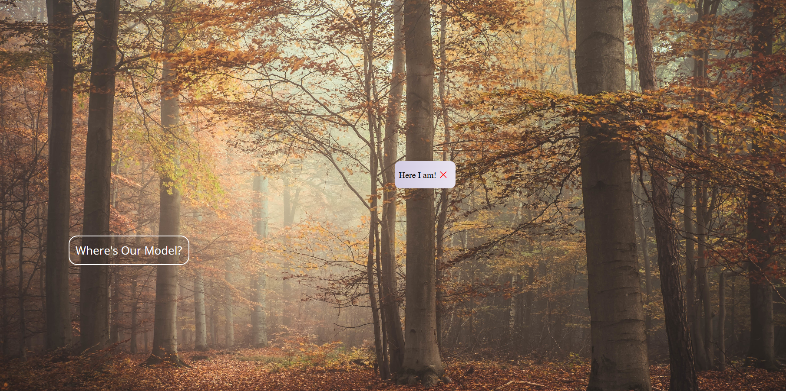

# PopUp-Model

This project demonstrates a simple HTML structure with CSS styling to create a popup and a button over with a functionality using javascript. The design is responsive and includes animations for the popup. 

## Features
- Popup component with animation
- Button with hover effects
- Responsive design for every screen

## Table of Contents

- [Demo](#demo)
- [Links](#links)
- [Built with](#built-with)
- [What I learned](#what-i-learned)
- [Author](#author)

## Demo

## Links
- URL : [URL here](https://github.com/Abhi1226L/PopUP-Model)

## Built with

- Semantic HTML5 markup
- CSS custom properties
- Flexbox
- Animation
- Vanilla JS

## What I learned

 I learnt using of CSS properties like background-size,position,,transition,animation and connecting that animation with javascript while the button is clicked

 ## Author

- Name - Abhishek

